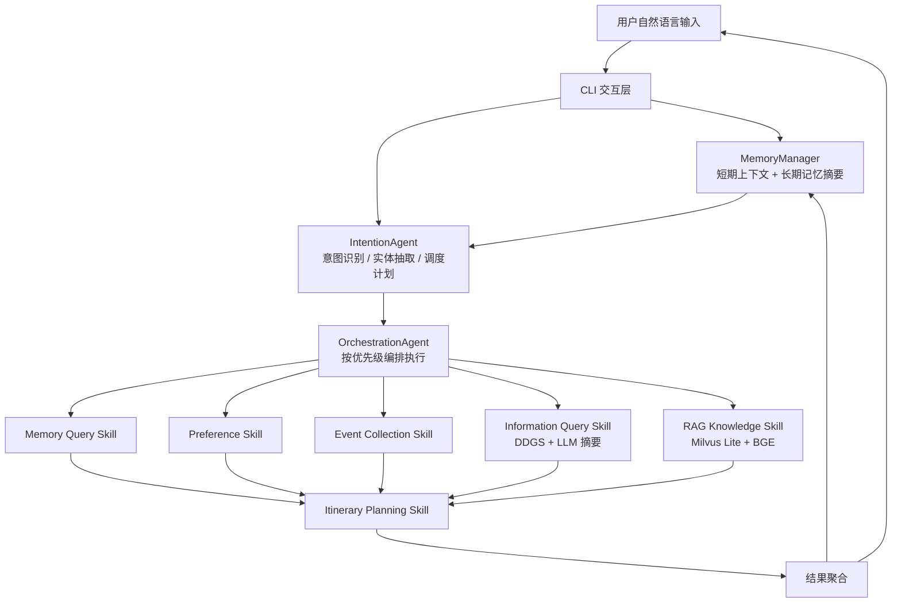

# TravelMind 企业差旅多智能体助手

CS599《企业级应用软件设计与开发》期末大作业项目。项目选择 **方向一：Agentic AI 原生开发**，从零构建一个面向企业差旅场景的多智能体系统，覆盖意图识别、任务编排、长期/短期记忆、企业知识库 RAG、联网信息查询和容错治理。

## 项目价值

企业差旅咨询通常分散在制度文档、报销规则、实时天气交通、个人偏好和历史行程中。传统关键词问答难以理解跨轮上下文，也无法将“查制度、补信息、记偏好、生成行程”串成完整闭环。TravelMind 将差旅助手拆分为多个可调度 Agent，由意图识别智能体生成计划，协调器按优先级并行或串行执行子智能体，最终汇总为自然语言结果并更新用户记忆。

## 核心功能

- **IntentionAgent**：基于 LLM 进行多意图识别、实体抽取、Query 改写和调度计划生成。
- **OrchestrationAgent**：按优先级编排多个子智能体，同优先级任务使用 `asyncio.gather` 并行执行。
- **Skill 插件化子 Agent**：通过 `.claude/skills/*/SKILL.md` 描述能力，运行时懒加载具体执行脚本。
- **记忆系统**：短期对话窗口 + 长期 JSON 持久化，用于偏好、历史行程和对话摘要。
- **Agentic RAG**：基于本地 BGE embedding 模型与 Milvus Lite，查询企业差旅制度知识库。
- **联网信息查询**：通过 DDGS 检索实时信息，再由 LLM 摘要。
- **可靠性治理**：指数退避重试、熔断器、健康检查命令，避免外部模型服务波动直接击穿体验。

## 作业要求对应关系

| 要求 | 本项目对应实现 |
| --- | --- |
| SDD 规格驱动开发 | `docs/specs/product_spec.md`、`architecture_spec.md`、`api_spec.md` |
| 工具使用 / Function Calling / MCP 类思想 | Skill 插件、RAG 检索、联网搜索、健康检查等工具化能力 |
| 记忆机制 | `context/short_term_memory.py`、`context/long_term_memory.py`、`context/memory_manager.py` |
| 状态管理与多步骤推理 | `IntentionAgent -> OrchestrationAgent -> Skill Agent -> Memory` |
| 多智能体协作 | 意图识别、协调器、记忆查询、偏好管理、事项收集、RAG、信息查询、行程规划 |
| 可观测性与评估 | `tests/`、`tests/results/`、熔断/健康检查、报告中的评估章节 |

## 系统架构



## 目录结构

```text
.
├── agents/                 # 意图识别、协调器、懒加载注册器
├── context/                # 短期/长期记忆与记忆管理
├── utils/                  # Skill 加载、JSON 解析、重试、熔断
├── .claude/skills/         # 插件化子智能体及企业差旅知识库
├── data/                   # 本地记忆样例与 embedding 模型
├── tests/                  # 功能测试与评估记录
├── docs/
│   ├── specs/              # Product / Architecture / API Specs
│   └── CS599_大作业报告.md  # 报告源文件，需导出 PDF
├── cli.py                  # 命令行入口
├── config.py               # 环境变量配置入口
└── .env.example            # 本地环境变量模板
```

## 快速开始

1. 创建环境并安装依赖：

```bash
python -m venv .venv
.venv\Scripts\activate
pip install -r requirements.txt
```

2. 配置环境变量：

```bash
copy .env.example .env
```

将 `.env` 中的 `LLM_API_KEY` 替换为自己的 API Key。不要把 `.env` 提交到 GitHub。

3. 初始化知识库：

```bash
python .claude/skills/ask-question/script/init_knowledge_base.py
```

4. 启动系统：

```bash
python cli.py
```

健康检查：

```bash
python cli.py health
```

## 测试与评估

可执行的基础测试包括：

```bash
python tests/test_memory_system.py
python tests/test_intention_agent.py
python tests/test_cli_qa.py
```

`tests/results/` 保存了问答评估记录，可作为报告第五章“测试与评估”的原始材料。由于 LLM 与联网搜索存在外部依赖，最终演示建议准备录屏或截图作为备选材料。

## 安全与学术诚信

- API Key 已改为通过环境变量读取，仓库中不应出现真实密钥。
- 如使用本项目以外的开源代码、模型或数据，请在报告和 README 中补充引用来源。
- 当前仓库包含本地 embedding 模型与示例知识库，若 GitHub 仓库体积过大，可改为在 README 中提供模型下载说明并使用 `.gitignore` 排除大文件。

## 课程提交清单

- GitHub 仓库命名为 `cs599-project`。
- Private 仓库添加 `qxr777` 为 Collaborator；Public 仓库保留 `LICENSE`。
- README、源码、测试、规格文档齐全。
- 导出 `docs/CS599_大作业报告.pdf`，并确保 PDF 含导航书签/目录。
- 2026 年 6 月 22 日 23:00 前提交最终仓库版本。

## License

MIT License. 见 `LICENSE`。
