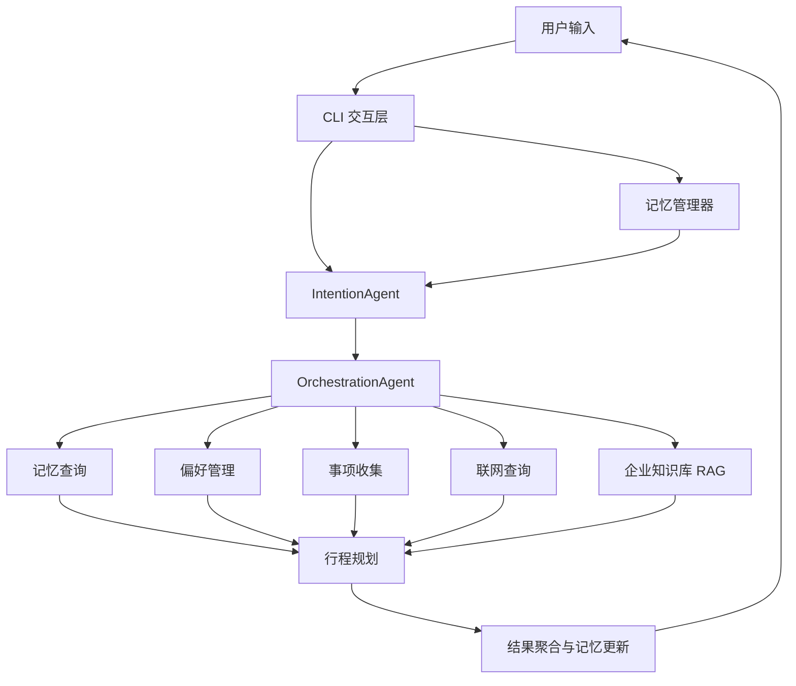

# 企业级应用软件设计与开发期末大作业报告

| 字段 | 内容 |
| --- | --- |
| 课程名称 | 企业级应用软件设计与开发 |
| 项目名称 | TravelMind 企业差旅多智能体助手 |
| 方向 | 方向一：Agentic AI 原生开发 |
| 学号 | 2025303057 |
| 姓名 | 任锦炫 |
| 专业 | 软件工程 |
| 指导教师 | 戚欣 |
| 提交日期 | 2026 年 6 月 22 日 |

> 导出 PDF 前，请在 Markdown/Word/LaTeX 工具中开启目录和 PDF 书签，生成 `docs/CS599_大作业报告.pdf`。

## 目录

- 一、选题背景与设计思想
- 二、Specs 规格文档
- 三、系统架构与设计
- 四、关键实现与代码展示
- 五、测试与评估
- 六、系统升级与扩展
- 七、课程总结
- 参考资料与引用声明

## 一、选题背景与设计思想

企业差旅是典型的多信息源、多步骤业务场景。员工需要同时了解企业制度、报销规则、实时天气交通、个人偏好、历史行程和目的地信息。传统问答系统通常只能回答单点问题，缺少跨轮记忆和任务编排能力；普通流程系统又难以理解自然语言中的模糊表达。

本项目选择从零构建一个 Agentic AI 原生系统，将“差旅咨询与行程规划”拆解为多个可协作智能体：意图识别智能体负责理解用户需求，协调器负责生成执行顺序和并行批次，子智能体分别承担记忆查询、偏好管理、事项收集、RAG 知识库问答、联网信息查询和行程规划。

技术路线如下：

- 使用 SDD 方法建立 Product Spec、Architecture Spec 和 API Spec。
- 使用 AgentScope 与 OpenAI 兼容模型接口构建 Agent。
- 使用 Skill 插件形式组织子智能体能力，降低扩展成本。
- 使用本地向量库和 embedding 模型实现企业差旅知识库 RAG。
- 使用短期窗口与长期持久化记忆支持跨会话个性化。
- 使用重试、熔断和健康检查提升演示稳定性。

## 二、Specs 规格文档

本项目采用 SDD（规格驱动开发）组织需求、架构和接口，规格文档位于：

- `docs/specs/product_spec.md`
- `docs/specs/architecture_spec.md`
- `docs/specs/api_spec.md`

Product Spec 定义目标用户、典型业务场景、功能需求和验收标准。Architecture Spec 描述系统模块、Agent 交互流程和数据流。API Spec 约束环境变量、IntentionAgent 输出 JSON、OrchestrationAgent 输入协议和 Skill Agent 目录约定。

规格文档直接约束了代码实现：`IntentionAgent` 必须输出可执行的 `agent_schedule`，`OrchestrationAgent` 必须根据 `priority` 批量调度，Skill 插件必须通过 `SKILL.md` 暴露能力说明。

## 三、系统架构与设计



Agent 交互流程：

1. 用户输入自然语言请求。
2. CLI 读取短期对话和长期记忆摘要。
3. IntentionAgent 执行多步骤推理，输出意图、实体、Query 改写和调度计划。
4. OrchestrationAgent 按优先级分组执行子智能体。
5. 信息收集类 Agent 并行执行，行程规划 Agent 读取前序结果后生成方案。
6. 系统聚合结果并更新长期记忆。

数据流设计：

- 用户输入和历史上下文进入 LLM 推理层。
- 结构化调度计划进入编排层。
- RAG、联网搜索和记忆系统作为工具层被 Agent 调用。
- 最终结果回写记忆并展示给用户。

## 四、关键实现与代码展示

关键代码位置：

- `agents/intention_agent.py`：构造意图识别 Prompt，要求 LLM 只输出 JSON。
- `agents/orchestration_agent.py`：根据 `priority` 进行分组，并通过异步任务执行同优先级 Agent。
- `agents/lazy_agent_registry.py`：按需发现和加载 Skill Agent。
- `utils/skill_loader.py`：读取 `SKILL.md` frontmatter，将能力描述注入 Prompt。
- `context/memory_manager.py`：统一短期记忆和长期记忆。
- `utils/llm_resilience.py`、`utils/circuit_breaker.py`：实现重试、健康检查和熔断。
- `config.py`：通过环境变量读取模型配置，避免硬编码密钥。

示例调度输出：

```json
{
  "agent_schedule": [
    {"agent_name": "event_collection", "priority": 1},
    {"agent_name": "rag_knowledge", "priority": 1},
    {"agent_name": "itinerary_planning", "priority": 2}
  ]
}
```

AI IDE 使用截图请在最终报告 PDF 中补充，例如：需求拆解、代码生成、测试修复、README 文档整理等过程截图。

## 五、测试与评估

测试材料位于 `tests/` 与 `tests/results/`。当前测试覆盖方向：

- 记忆系统：短期记忆、长期偏好、历史行程、对话记录。
- 意图识别：不同用户表达下的意图分类与结构化输出。
- RAG 问答：企业差旅制度与报销规则查询。
- 编排流程：调度计划解析、并行批次执行和结果聚合。
- CLI 问答：从命令行完成端到端体验。

建议在最终提交前补充以下证据：

- 运行测试截图。
- 至少 3 组端到端 Demo 截图。
- `tests/results/` 中问答结果的简要统计表。
- 如 API 不稳定，补充本地录屏作为 Demo Day 备选。

示例评估指标：

| 指标 | 目标 | 说明 |
| --- | --- | --- |
| 意图识别可用率 | 90%+ | 典型差旅问题是否生成正确调度计划 |
| RAG 命中率 | 85%+ | 制度问题是否能检索到相关文档 |
| 偏好持久化成功率 | 95%+ | 跨会话能否读取历史偏好 |
| 端到端响应成功率 | 80%+ | 受外部 LLM 和联网搜索影响 |

## 六、系统升级与扩展

下一阶段计划：

- 将 CLI 升级为 Web UI 或企业微信/飞书机器人入口。
- 增加 LangGraph 状态机，使流程恢复、失败分支和人工确认更清晰。
- 引入 OpenTelemetry 或 LangSmith 类 tracing，对每次 Agent 调用记录耗时、输入输出和失败原因。
- 增加沙箱化工具调用，避免外部工具异常影响主流程。
- 将长期记忆从 JSON 文件升级为 PostgreSQL 或 Redis + PostgreSQL 组合。
- 增加权限控制，区分普通员工、财务、管理员可见的制度内容。

## 七、课程总结

通过本项目，我对“写一个模型调用脚本”和“构建一个 Agentic AI 系统”的差异有了更具体的认识。后者不仅要关注单次回答质量，还要关注规格约束、状态管理、工具边界、失败恢复、记忆持久化和可评估性。

SDD 方法让我先定义输出协议和验收标准，再实现 Agent 逻辑，减少了 Prompt 和代码之间互相漂移的问题。多智能体编排也让我意识到，Agent 系统的关键不是堆叠更多模型调用，而是把任务拆成可观察、可替换、可测试的能力单元。

对课程的建议：可以增加一次关于 Agent 评估方法的课堂实践，例如如何设计小型 benchmark、如何记录 trace、如何判断 Agent 行为是否稳定。这会帮助项目从“能演示”进一步走向“可验证”。

## 参考资料与引用声明

- AgentScope 官方文档与开源项目。
- Milvus / PyMilvus 官方文档。
- BAAI BGE 中文 embedding 模型说明。
- DDGS / DuckDuckGo 搜索相关开源库。
- 本仓库如包含来源于外部项目的代码或资料，请在最终提交前补充具体来源、链接和许可证。
