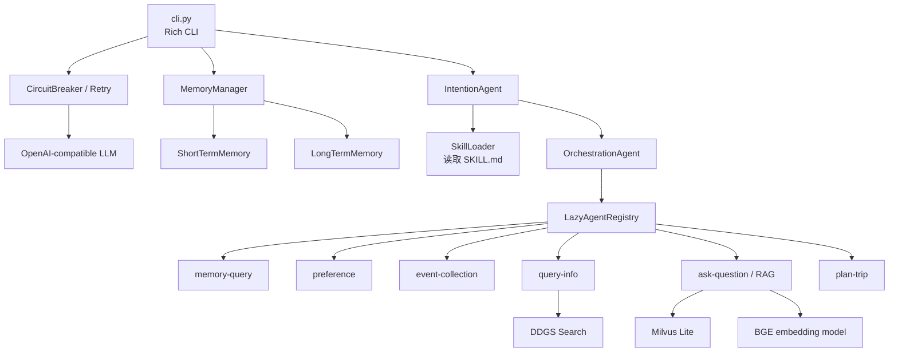
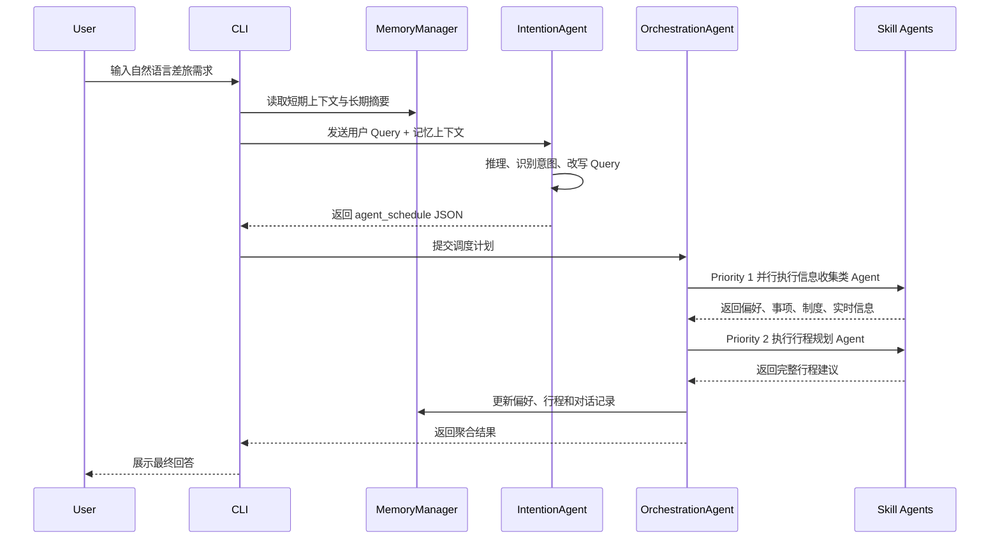

# Architecture Spec: TravelMind

## 1. 总体架构

## 2. 核心模块

| 模块 | 文件 | 职责 |
| --- | --- | --- |
| CLI | `cli.py` | 用户交互、系统初始化、命令处理、结果展示 |
| IntentionAgent | `agents/intention_agent.py` | 多意图识别、实体抽取、Query 改写、生成调度计划 |
| OrchestrationAgent | `agents/orchestration_agent.py` | 按优先级调度子 Agent，执行并行批次，聚合结果 |
| LazyAgentRegistry | `agents/lazy_agent_registry.py` | 根据调度计划按需加载 Skill Agent |
| MemoryManager | `context/memory_manager.py` | 整合短期记忆与长期记忆 |
| SkillLoader | `utils/skill_loader.py` | 读取 `.claude/skills/*/SKILL.md`，为 Prompt 注入能力描述 |
| Resilience | `utils/llm_resilience.py`、`utils/circuit_breaker.py` | 重试、退避、熔断与健康检查 |

## 3. Agent 交互流程

## 4. 数据流设计

1. 输入层：用户自然语言、命令行指令、健康检查指令。
2. 上下文层：短期记忆提供最近对话，长期记忆提供偏好和历史摘要。
3. 推理层：IntentionAgent 生成 JSON 调度计划。
4. 执行层：OrchestrationAgent 读取计划并调用 Skill Agent。
5. 工具层：RAG、联网搜索、持久化记忆、LLM 摘要。
6. 输出层：结构化结果被 CLI 转换为用户可读文本。

## 5. 扩展点

- 新增 Skill：在 `.claude/skills/<name>/SKILL.md` 中声明能力，并在 `script/agent.py` 中实现。
- 替换模型：修改环境变量 `LLM_MODEL_NAME`、`LLM_BASE_URL`、`LLM_API_KEY`。
- 替换知识库：更新 `.claude/skills/ask-question/data/documents/` 后重新初始化 Milvus Lite。
- 接入 Web/API：复用 `IntentionAgent` 与 `OrchestrationAgent`，将 CLI 层替换为 FastAPI 或前端服务。
